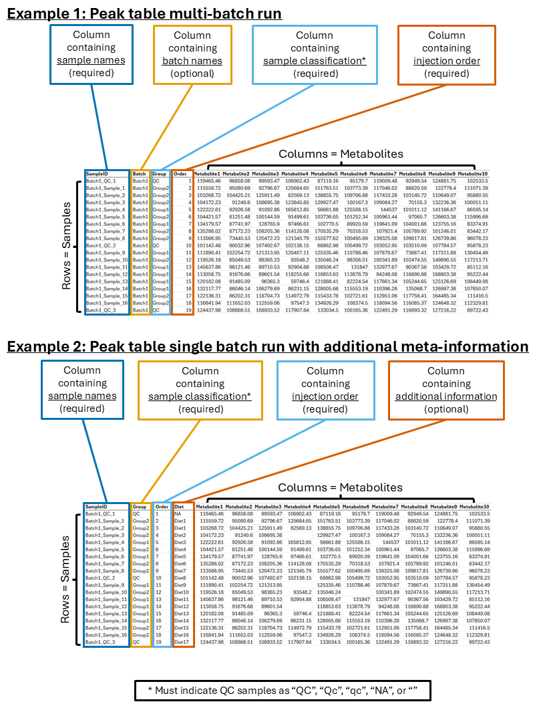

# MetaboRx

MetaboRx is an interactive application for metabolomics data quality assessment, signal drift correction, normalization, visualization, and export. It runs in a web browser, but your data stays in the R session running on your computer.

You do not need prior programming experience. You do not need Git or a command-line terminal. The only R commands required are provided below for you to copy and paste into RStudio.

## Before you begin

MetaboRx requires R 4.4 or newer. For the easiest installation, install both R and RStudio Desktop. RStudio includes Pandoc, which MetaboRx uses to create the HTML quality report included in Download All.

### Windows

1. Download and install the current version of [R for Windows](https://cran.r-project.org/bin/windows/base/).
2. Accept the installer defaults.
3. Download and install [RStudio Desktop](https://docs.posit.co/ide/user/#rstudio-ide-oss-downloads).
4. Open RStudio from the Start menu.

### macOS

1. Download the current R installer for your version of macOS from [R for macOS](https://cran.r-project.org/bin/macosx/).
2. Open the downloaded `.pkg` file and accept the installer defaults.
3. Download and install [RStudio Desktop](https://docs.posit.co/ide/user/#rstudio-ide-oss-downloads).
4. Open RStudio from the Applications folder. If macOS asks for confirmation, choose Open.

### Linux

1. Follow the instructions for your distribution on [R for Linux](https://cran.r-project.org/bin/linux/).
2. Download the matching [RStudio Desktop](https://docs.posit.co/ide/user/#rstudio-ide-oss-downloads) installer for your distribution.
3. Install both applications using your distribution's normal software installer, then open RStudio.

## Install MetaboRx

Installation is required only once. In RStudio, click inside the Console pane, copy the entire block below, paste it into the Console, and press Enter. The `>` symbol shown by RStudio is the Console prompt; do not type it yourself.

```r
install.packages(c("BiocManager", "remotes"))
BiocManager::install(c("impute", "pmp"), ask = FALSE, update = FALSE)
remotes::install_github(
  "breguppy/MetaboRx",
  dependencies = NA,
  upgrade = "never"
)
MetaboRx::check_required_dependencies()
```

The installation can take several minutes and may print many lines of text. Wait until the `>` prompt returns. A successful dependency check returns quietly without an error.

If RStudio asks whether to create or use a personal package library, choose Yes. If it asks to update existing packages, choose No unless you intentionally want to update your whole R installation.

## Start and stop MetaboRx

Each time you want to use the app, open RStudio and run:

```r
MetaboRx::run_app()
```

MetaboRx should open in your default web browser. Keep RStudio open while using the app.

To stop the app, return to RStudio and click the red Stop button above the Console, or press Escape. Close the browser tab afterward. To restart the app, run `MetaboRx::run_app()` again.

## Quick start with example data

1. [Download the MetaboRx example CSV](https://github.com/breguppy/MetaboRx/raw/refs/heads/main/inst/example_data/example_data.csv) and save it somewhere easy to find, such as Downloads.
2. Start the app with `MetaboRx::run_app()`.
3. In tab 1, select the downloaded `example_data.csv` file.
4. Map the columns as follows:

   - Sample column: `SampleID`
   - Batch column: `Batch`
   - Class column: `Group`
   - Injection order column: `Order`
   - Additional metadata columns: none

5. Continue through missing-value filtering and imputation. For a first walkthrough, keep the displayed defaults.
6. In tab 2, use the correction method MetaboRx selects as recommended for the example data, then continue with the displayed filtering and normalization defaults.
7. In tab 3, inspect the metabolite, RSD, and PCA plots. Select PDF or PNG under Select figure format.
8. Click Download All in tab 4. Your browser saves a ZIP archive, usually in your Downloads folder.

Browser settings control the exact download location. If you cannot find the ZIP file, open your browser's Downloads list.

## What Download All contains

The ZIP archive contains:

- Corrected and transformed data in Excel format.
- Missing-value summaries.
- Corrected-data and, when applicable, transformed-data RSD summaries.
- Candidate extreme-value summaries.
- Optional metabolite-correlation results when correlations were calculated.
- Metabolite, RSD, PCA score, and PCA loading figures in the selected PDF or PNG format.
- An Excel workbook containing PCA loadings.
- `quality_report.html`, a self-contained report describing the data checks, processing choices, results, and figures.

Double-click `quality_report.html` to open it in a browser. The report does not require an internet connection after it has been downloaded.

## Update or reinstall MetaboRx

To install the newest GitHub version, restart R first by choosing Session > Restart R in RStudio, then run:

```r
remotes::install_github(
  "breguppy/MetaboRx",
  dependencies = NA,
  upgrade = "never",
  force = TRUE
)
MetaboRx::check_required_dependencies()
```

To remove MetaboRx completely:

```r
remove.packages("MetaboRx")
```

You can then repeat the installation instructions above.

## Troubleshooting

### A package will not install

- Restart RStudio with Session > Restart R and repeat the full installation block.
- Confirm that your R version is 4.4 or newer by running `R.version.string`.
- On Windows, install the matching version of [Rtools](https://cran.r-project.org/bin/windows/Rtools/) if an error says that build tools are required.
- On macOS, follow the compiler-tool guidance on the [R for macOS tools page](https://mac.r-project.org/tools/).
- On Linux, follow the system dependency guidance for your distribution on [R for Linux](https://cran.r-project.org/bin/linux/).
- Copy the complete error message when submitting a bug report; the final lines usually contain the useful cause.

### MetaboRx says Pandoc is missing

Install or update RStudio Desktop, close every RStudio window, and open it again. RStudio includes Pandoc. Users who intentionally run R without RStudio must install Pandoc separately and ensure that R can find it.

You can verify Pandoc with:

```r
rmarkdown::pandoc_available()
```

The result should be `TRUE`.

### The app does not open a browser

Look in the RStudio Console for a local address beginning with `http://127.0.0.1:`. Copy that complete address into your browser. Do not close RStudio while using the app.

### PDF export fails

MetaboRx prefers R's Cairo PDF device for high-quality output and automatically falls back to the standard R PDF device when Cairo is unavailable. Restart RStudio and retry the download. If both PDF and PNG fail, run `MetaboRx::check_required_dependencies()` and include the resulting message in a bug report.

### Installation permission errors

When RStudio offers to create a personal package library, choose Yes. Avoid installing packages into a shared system library unless your organization manages R centrally. On a managed work computer, your IT department may need to allow R package installation in your user profile.

## Data input requirements

MetaboRx accepts `.csv`, `.xls`, and `.xlsx` files. Spreadsheet data must be on the first sheet.

- Rows are samples.
- Columns are metadata fields and metabolites.
- A sample identifier column is required and must contain unique values.
- A class column is required. QC samples may be labeled `QC`, `Qc`, or `qc`, or left blank/missing. Blank samples may be labeled `blank`, `processing blank`, or `pb`.
- An injection-order column is required.
- A batch column is optional for single-batch data.
- Any other metadata columns must be identified during import.
- After blank samples are excluded and data are sorted by injection order, the run must begin and end with QC samples.
- Internal-standard column names must contain `ISTD` or `ITSD`.

### Example data structure

<p align="center">
  
</p>

## Help, bug reports, and feature requests

Submit bugs and feature requests through [GitHub Issues](https://github.com/breguppy/MetaboRx/issues). Include:

- Your operating system.
- The output of `R.version.string`.
- The complete error message.
- The step you were performing.
- A small example file when the data are safe to share.

Pull requests are welcome through the [MetaboRx repository](https://github.com/breguppy/MetaboRx/pulls).

## Citation

Citation information is coming soon.
